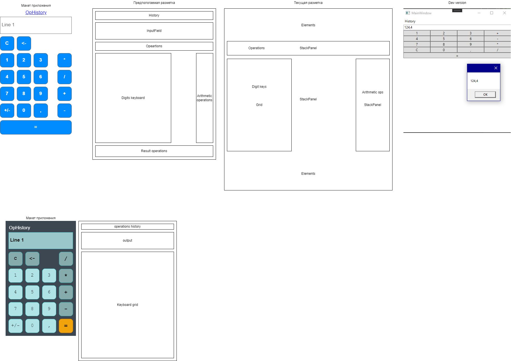

# CalculatorTeamWork

Teamwork calculator - Коммандный проект (лабораторная работа) деманстрирующий командную разработку приложения на примере калькулятора

## Команда

* Лапшин - Заказчик
* Мрясов - Тимлид + фронт/бэк
* Шишков - Внешний вид(фронт)
* Одиванов - Логика калькулятора(бэк)

***********************************

### Журнал

---

#### Задачи на 21 августа(понедельник)

***Одиванов***

* ~~Сделать класс калькулятор и объявить функции с возможностью возврата результата(заглушки).~~ `Completed`
* ~~Сделать структуру, которая будет возвращать статус(error, success) результата и сам результат.~~ `Completed`
* ~~Основной тип данных для структуры float.~~ Completed
* ~~Класс не должен принимать элементы интерфейса. На ввод тип float, на вывод структура(статус, значение).~~ `Completed`

***Шишков***

* ~~Текстбокс с readonly.~~ `Completed`
* Внешний вид полностью.
* ~~Реализовать нажатия кнопок приложения: цифры - ввод в текстбокс, операции - сохранение в переменной, цифра, введенная до операции сохраняется в лэйбл~~ `Completed`
* ~~Основные операции - сложение, вычитание, умножкние, деление~~ `Completed`

***Итог работ:***

* Реализован бэкэкнд полностью
* Фронтэнд частично
* необходимы доработки по внешнему виду

---

#### Задачи на 25 августа(пятница)

***Внешний вид:***

* настроить отступы между кнопками/границами контейнера.
* подумать над оптимизацией xaml-разметки, конкретно уменьшению количества панелей
* опционально: сделать современный внешний вид приложения(цвета, шаблоны кнопок, стили нажатия)

***Логика:***

* ~~починить повторный ввод запятой~~ `Completed`
* ~~сделать расчет результата после нажатия одного из операторов с последующим сохранением оператора и результата(если это целесообразно)~~ `Completed`

---

#### Собрание 19 августа(суббота)

[Запись собрания (Без звука)](https://drive.google.com/file/d/1-3mjUn1OWa3ZnAhh9a_GIPZgN5ssvGAh/view?usp=drive_link)

***Присутствовавшие:***

* Одиванов
* Мрясов

***Выполнено:***

* Создан класс калькулятор, Структура результата, перечесление статуса. Реализованы базовые операции сложение, вычитание, умножение, деление
* Выполнена векрстка формы приложения
* Выполнена логика интерфейса приложения

***На доработку***

* ~~После результирующей функции по нажатию на операцию продолжить вычисление, по нажатие на цифру очистить поле ввода и добавить введеную цифру~~ `Completed`

#### Собрание 22 августа (вторник)

***...***

## Диаграммы и Скриншоты

